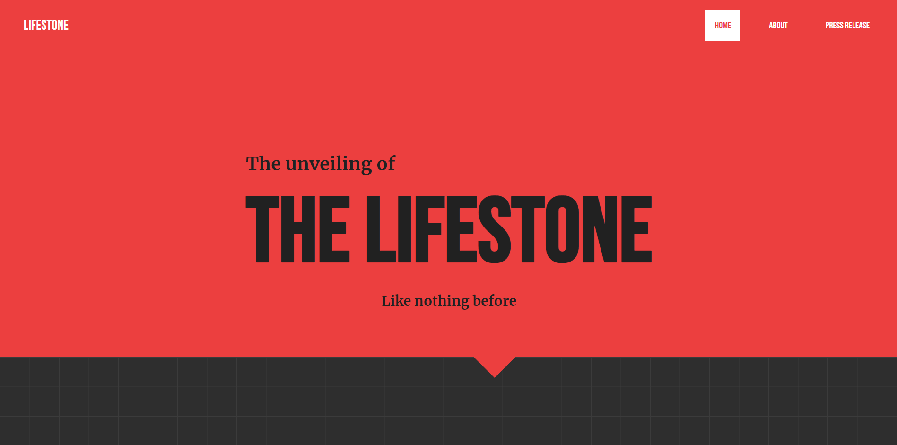
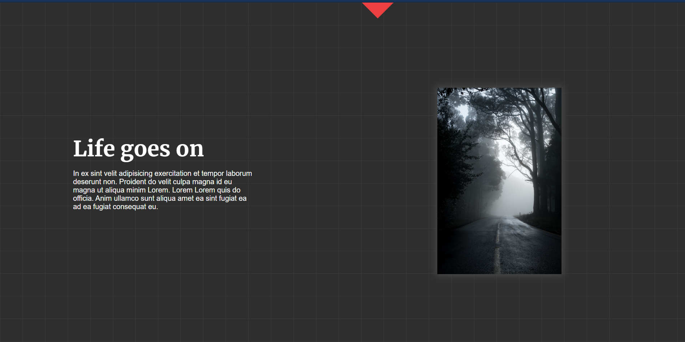

# Lifestone - CSS Landing Page
Learning and exercising a few CSS features: triangle like a shape divider, using CSS grids, FLEX, etc.  

_All of it is custom CSS, except the background pattern which uses pattern.min.css_  

### Screenshots

